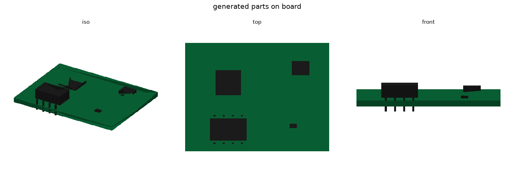
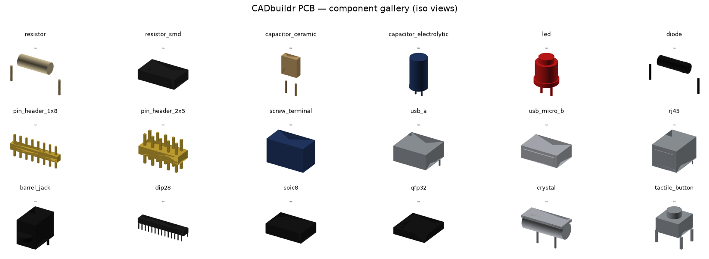
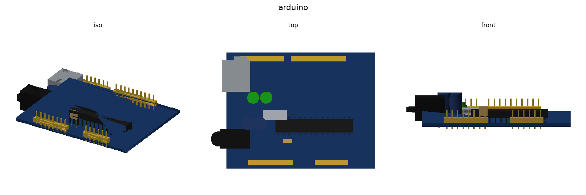
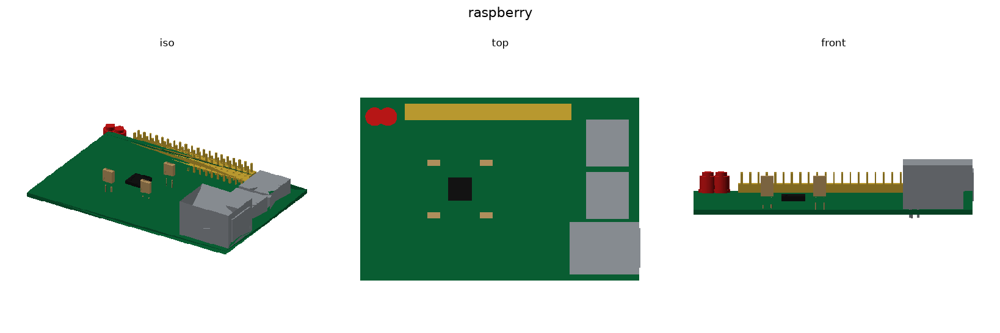

# cadbuildr.electronics

## Summary

3D models of common printed-circuit-board components (resistors, capacitors,
LEDs, pin headers, USB / Ethernet connectors, ICs, crystals, …) plus a small,
reusable framework for placing them onto boards. The framework's headline
feature is a **footprint dual-action**: a single `place(...)` call both drills
the component's land pattern into the board *and* seats its 3D body in the
assembly, so the two can never drift apart.

## Tags

cad, python, pcb, electronics, footprint, assembly

## Status

yellow

## Guidelines

- A component owns its footprint. Define the pads **once** (in `footprint()`),
  never separately on the board.
- All dimensions are millimetres; through-hole pads use `drill > 0`, SMD lands
  use `drill == 0`. The board is the only thing that drills holes.
- Keep component bodies built from the proven `Sketch` + `Extrusion` primitives
  (see `_solids.py`) so DAG generation stays kernel-agnostic and testable.
- Reference boards (`boards/`) are stylised approximations for visual
  validation — recognisable, not pin-accurate clones.

## Install / develop

```bash
pip install cadbuildr-electronics      # from PyPI
# or, working from a clone:
uv sync && uv run pytest               # run the test suite
```

## Quick start

```python
from cadbuildr.foundation import show
from cadbuildr.electronics import PCB, PinHeader, Resistor, LED

pcb = PCB(50, 24, color="blue")
pcb.place(PinHeader(positions=2), ref="J1", x=-20, y=0)   # drills board + seats body
pcb.place(Resistor("220"),        ref="R1", x=-2,  y=0)
pcb.place(LED("red"),             ref="D1", x=18,  y=0)
show(pcb)
```

Declarative form (the "standard format" of components + placements):

```python
from cadbuildr.electronics import PCB, Placement, Resistor, LED, PinHeader

PCB.from_placements(50, 24, [
    Placement(PinHeader(positions=2), "J1", -20, 0),
    Placement(Resistor("220"),        "R1",  -2, 0),
    Placement(LED("red"),             "D1",  18, 0, rotation=0),
])
```

## Scaling to catalog size

Writing a class per part doesn't scale; Digi-Key's ~18 M part numbers collapse
onto ~15 k footprints and a few dozen **package families**, because geometry is
a pure function of `Package/Case + Mounting + pins + pitch`, never the
electrical value. So there's a **data-driven catalog layer** (`catalog/`,
`families/`, `data/`):

```
 K family generators  ◀──  M packages (data)  ◀──  N parts (data)
   families/                data/packages.json       data/parts.csv
```

```python
from cadbuildr.electronics import Catalog, PCB
cat = Catalog.load()
pcb = PCB(40, 30)
pcb.place(cat.build_part("ATMEGA328P-AU"), "U1", 0, 0)  # MPN → TQFP-32, generated
pcb.place(cat.build_part("NE555P"),        "U2", 12, -8)  # MPN → DIP-8, generated

# ingest a Digi-Key Package/Case string straight to geometry:
cat.resolve_package_case("0805 (2012 Metric)", mounting="Surface Mount")  # → R_0805
```

Adding a part is one CSV row; a new package is one JSON row; a new family is one
generator class. Land patterns are generated to **IPC-7351B**. Full design in
[`docs/SCALING.md`](docs/SCALING.md). Generated parts on a board:



## How the dual-action works

```
component.footprint()  ─┬─▶  board.apply_footprint(...)   # cut holes / paint pads
                        └─▶  assembly.add_component(...)   # seat the 3D body
                              (same x, y, rotation maths → holes always line up)
```

- **`Footprint` / `Pad`** (`footprint.py`) — the single source of truth for a
  part's pads. `transformed_pads(x, y, rot)` is shared by the board and the
  assembly, which is what makes placement non error-prone.
- **`ElectronicComponent`** — base class for parts; subclasses build geometry
  and implement `footprint()`. Any `Part` can instead be decorated with
  `@footprint(...)`.
- **`PCBBoard`** (`board.py`) — the FR-4 slab; `apply_footprint` / `drill`.
- **`PCB`** (`pcb.py`) — the `Assembly` template that wires the two together
  and exposes `place`, `from_placements`, `mounting_holes_rect` and `bom`.

## What's in the box

| Family | Parts |
|--------|-------|
| Passives | `Resistor`, `ResistorSMD`, `CeramicCapacitor`, `ElectrolyticCapacitor` |
| Diodes | `LED`, `Diode` |
| Connectors | `PinHeader`, `ScrewTerminal`, `USBTypeA`, `USBMicroB`, `RJ45`, `BarrelJack` |
| ICs | `DIP`, `SOIC`, `QFP` |
| Misc | `Crystal`, `TactileButton` |
| Boards | `ArduinoUno`, `RaspberryPi` (reference assemblies) |

For the standard names (KiCad / JEDEC / IPC), canonical dimensions, and
authoritative + license-clean 3D-model sources behind each part, see
[`docs/COMPONENT_REFERENCE.md`](docs/COMPONENT_REFERENCE.md).

## Visual verification

The library is checked by actually *rendering* it. `scripts/render.py` sends a
part's DAG to a local **kernel-api** (the same replicad/OpenCascade kernel the
web viewer uses — no GPU, no display, no cloud auth) and rasterizes the colored
mesh to a PNG. Full setup in
[`docs/VISUAL_VERIFICATION.md`](docs/VISUAL_VERIFICATION.md):

```bash
# kernel-api running locally on :8087 (see the doc), then:
python scripts/render.py --target arduino -o /tmp/arduino.png
python scripts/render.py --gallery        -o /tmp/pcb_gallery
```

Checked-in reference renders (regenerate any time):



| Arduino Uno | Raspberry Pi |
|---|---|
|  |  |

## Dependencies

### Upstream

- cadbuildr-foundation
- cadbuildr-stdlib

### Downstream

- (none)

## GitHub Pages demo (Vite + R3F)

A static browser demo (`kernel-api` + Pyodide) lives in `github-io/`. It builds
PCB examples in-browser and renders them via
[`@cadbuildr/sdk-react`](https://www.npmjs.com/package/@cadbuildr/sdk-react):

```bash
uv build                                   # produce the wheel for micropip
cd github-io && npm install && npm run dev # http://localhost:3008
```

See `github-io/README.md` for auth, the wheel pipeline, and the GitHub Pages
deploy workflow.
